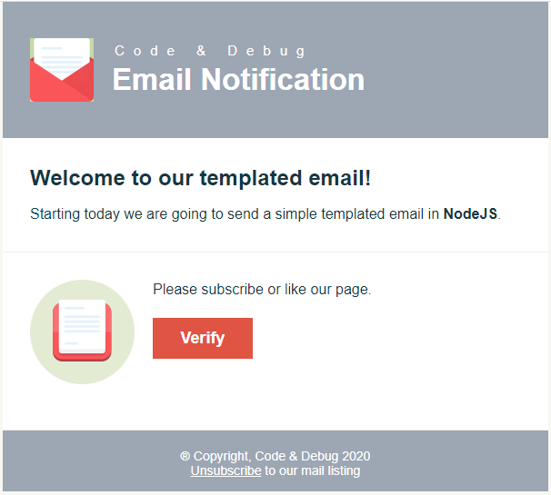
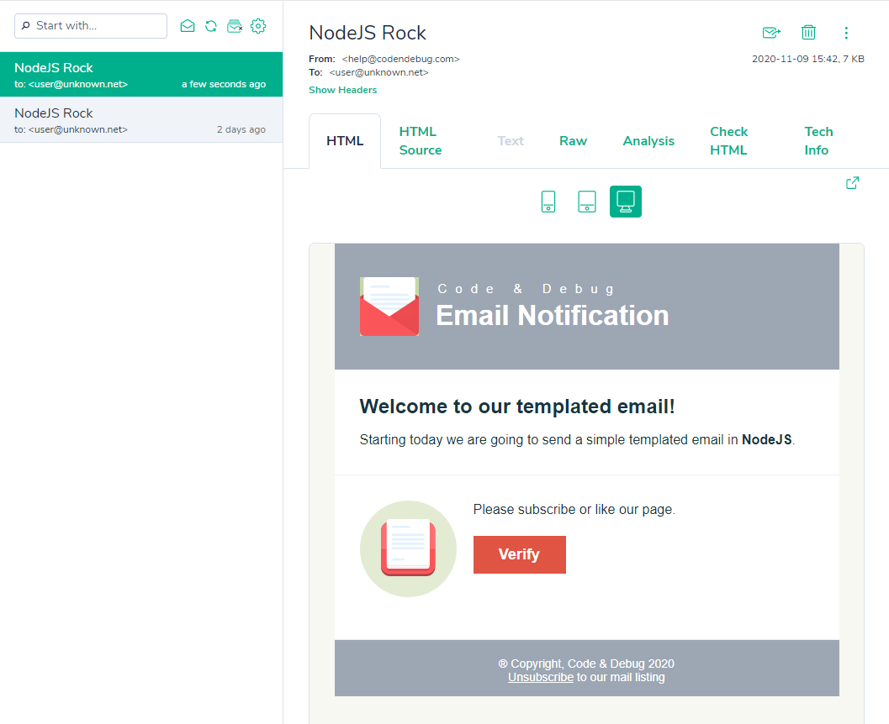
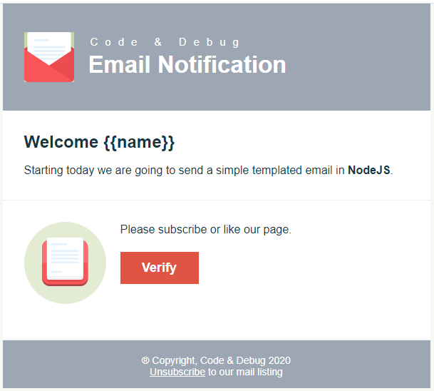
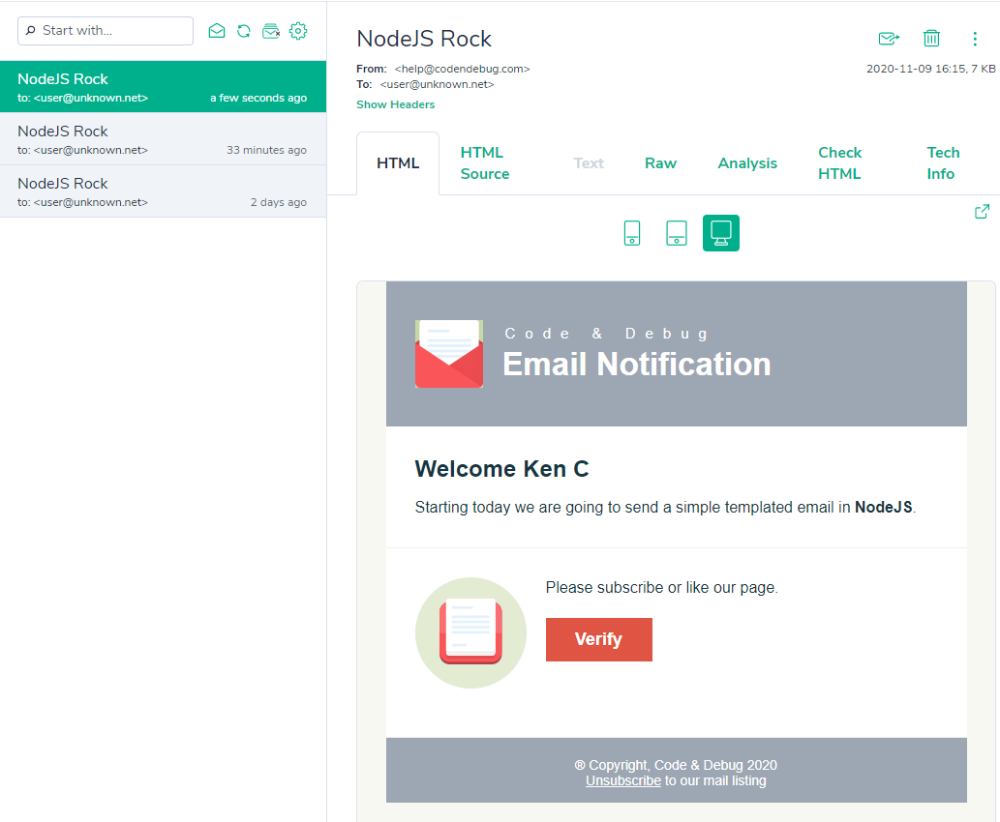

Branding is a process of giving a meaning to a company or organization. So it's really important to customize the way your email should look like and behave in the user's inbox.

Today, we are going to send a templated email in [NodeJS](https://nodejs.org/en/) using [Nodemailer](https://nodemailer.com/).

> I highly recommend that you should check our previous [blog](https://codendebug.com/blogs/send-email-with-nodejs) before moving on.

# Get Started

Email template is a simple "HTML with CSS" file that renders in your inbox.

> We will be using a templated email to better illustrate the idea without focusing on building an email template itself.

Our Email Template looks like this:



## Coding

Now, let's prepare our email sender by getting the HTML in our `email.js`.

```javascript
// we will be adding this code into our exisitng email.js
const fs = require("fs");
const templatedEmail = fs
  .readFileSync("templatedEmail.html", { encoding: "utf-8" })
  .toString();
```

This allows us to get `templatedEmail.html` as `string` then pass it in our mail transport.

Luckily, nodemailer transport has the property `html`. Which allows you to send an HTML format email instead of plain text.

Our `transport` object should now look like this.

```javascript
// send mail with defined transport object
transport
  .sendMail({
    from: "help@codendebug.com", // sender address
    to: "user@unknown.net", // receiver address
    subject: "NodeJS Rock", // Subject line
    // text: "Hello Email World!", // plain text body
    html: templatedEmail, // send HTML instead of plain text
  })
  .then((data) => {
    console.log("Message sent: %s", data.messageId);
    // Message sent: <3a4026d0-b901-b89a-58c5-51bfe14e0b42@codendebug.com>
  })
  .catch((error) => {
    // Do something if there is problem with email
    console.log("error", error);
  });
```

Now you will receive this cool email.



## Static HTML to Dynamic Email

Remember that we only have a static HTML and if you want to render data in it, we need to add a [templating engine](https://expressjs.com/en/guide/using-template-engines.html).

There are many options to choose with `JS Template Engines`.

- [Handlebars](https://handlebarsjs.com/)
- [EJS](https://ejs.co/)
- [Pug](https://pugjs.org/api/getting-started.html)

My preference is to use [Handlebars](https://handlebarsjs.com/) whenever I want to convert the static html to dynamic html.

Let's start by installing handlebars.

```bash
npm install handlebars
```

We only need 3 line of codes to make our static HTML into dynamic email.

```javascript
//import handle bar
const Handlebars = require("handlebars");

//compile the templatedEmail
const template = Handlebars.compile(templatedEmail);

// dynamic data
const data = {
  name: "Ken C",
};

//pass the data to the template
const dynamicEmail = template(data);
```

Our `transport` object should now look like this.

```javascript
// send mail with defined transport object
transport
  .sendMail({
    from: "help@codendebug.com", // sender address
    to: "user@unknown.net", // receiver address
    subject: "NodeJS Rock", // Subject line
    html: dynamicEmail, // send dynamic HTML
  })
  .then((data) => {
    console.log("Message sent: %s", data.messageId);
    // Message sent: <3a4026d0-b901-b89a-58c5-51bfe14e0b42@codendebug.com>
  })
  .catch((error) => {
    // Do something if there is problem with email
    console.log("error", error);
  });
```

Before we run our email sender, we need to edit our `templatedEmail.html` to use the handlebars syntax to render our `data`.

We will be using this `{{variable}}` format that tells the handlebar engine to replace it with `data`'s content.

Our HTML should now look like this.
The `name` is the variable that is passed through the `template` function.



Running the `email.js` would result to this:



# Summary

With this you can now send simple notification to your users like Email Verification, Payment Confirmation, Order Status, Marketing Emails and many more.

We hope this could help you in your future applications.

Happy Coding :)
