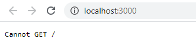
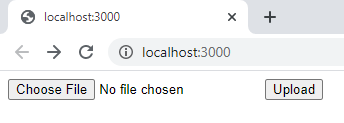
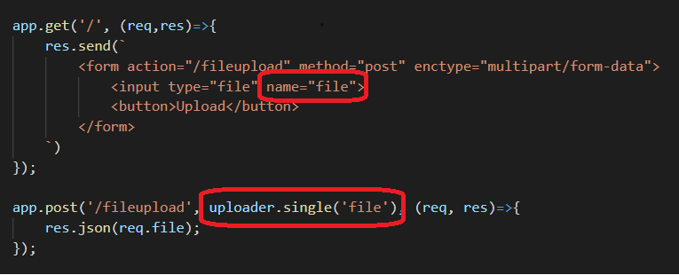
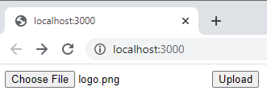
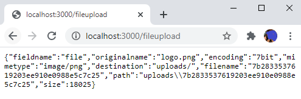

A **file** is a collection of data stored in one unit, identified by a filename. This can be image, csv, doc, pdf and more.

Website can receive files from user through upload, and in this blog, we are going to upload files using [ExpressJS](https://expressjs.com/) and [Multer](https://www.npmjs.com/package/multer).

# Prerequisite

Before we move on, make sure that you have [NodeJS](https://nodejs.org/en/) installed in your machine.
You can test this by opening a command line and typing.

```bash
node -v
v12.18.4
```

# Getting Started

Let's create a project folder called `fileuploader`.
```
mkdir fileuploader
```

We can now setup our [npm](https://www.npmjs.com/) inside our `fileuploader` .
```
cd fileuploader
npm init -y
```

This will create our initial **config** of [npm](https://www.npmjs.com/), that we will be needing in **getting other packages**.

First, let's install [expressjs](https://expressjs.com/) as our **web server**, and [multer](https://www.npmjs.com/package/multer) for **handling file uploads**.

```
npm install express
npm install multer

# or 
# npm install express multer
```

## Intializing our basic **Web Server**

Let's create `app.js` which will run our **web server**.

```javascript
const express = require('express');
const app = express();

app.listen(3000, ()=>{
    console.log('Listening on http://localhost:3000');
});
```

Run our **web server**.
```
node app.js
Listening on http://localhost:3000
```

We can now visit [http://localhost:3000](http://localhost:3000).



## Basic **upload** form
Since we are doing **upload**, we need **form** to test our application.
Here is a simple **form** that **accepts** file to upload.
```javascript
app.get('/', (req,res)=>{
    res.send(`
        <form action="/fileupload" method="post" enctype="multipart/form-data">
            <input type="file" name="file">
            <button>Upload</button>
        </form>
    `)
});
```

We can now **upload** a file.




After setting up our form, we can now add [multer](https://www.npmjs.com/package/multer) in our `app.js`. [Multer](https://www.npmjs.com/package/multer) is a **node.js middleware** for handling **multipart/form-data**, which is primarily used for uploading files.

What we want is to **upload** file in `/fileupload` route.

```javascript
// get multer libary
const multer = require('multer');
const uploader = multer({
    dest: 'uploads/'    //folder path of uploaded file
});

// input name should be "file"
app.post('/fileupload', uploader.single('file'), (req, res)=>{
    res.json(req.file); // return the file information
});
```

By combining all the changes above, our `app.js` should now look like this.

```javascript
const express = require('express');
const app = express();

// get multer libary
const multer = require('multer');
const uploader = multer({
    dest: 'uploads/'    //folder path of uploaded file
});

app.get('/', (req,res)=>{
    res.send(`
        <form action="/fileupload" method="post" enctype="multipart/form-data">
            <input type="file" name="file">
            <button>Upload</button>
        </form>
    `)
});

// input name should be "file"
app.post('/fileupload', uploader.single('file'), (req, res)=>{
    res.json(req.file); // return the file information
});

app.listen(3000, ()=>{
    console.log('Listening on http://localhost:3000');
});
```

> Take note that the `name` of our `input type` should be equal to the `uploader.single` name.



Re-run the application by typing `node app.js` in command line.

We can now accept **file** upload into our website.





# Summary

The ability to upload files on a website is a common feature that is taken for granted. By adding this functionality, you can enable users or customers to upload documents and images that makes them more engaged in your site.

I hope this gives you initial idea on how you can implement a simple upload in your [NodeJS](https://nodejs.org/en/) application.

Happy Coding 😃