One way to scale your application is to offload some resources in your server. As a developer, you should know when to take advantage the use of SaaS (Software as a Service) services.

A good example to scale your application is to push your file uploads into [AWS S3](https://aws.amazon.com/s3/).

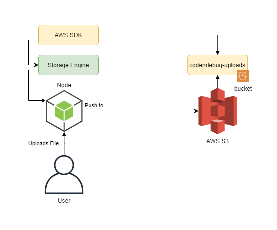

> NOTE: This blog has a **Part 1** : [How to upload files in NodeJS](https://codendebug.com/blogs/upload-files-with-nodejs-express-and-multer). Check it out first before proceeding.

# Prerequisite

Before we can start uploading files into [AWS S3](https://aws.amazon.com/s3/), you first need to create an account in [AWS](https://portal.aws.amazon.com/billing/signup?refid=em_127222&redirect_url=https%3A%2F%2Faws.amazon.com%2Fregistration-confirmation#/start).

If you already have the account, follow these steps to get your credentials

1. Create user in IAM
   
   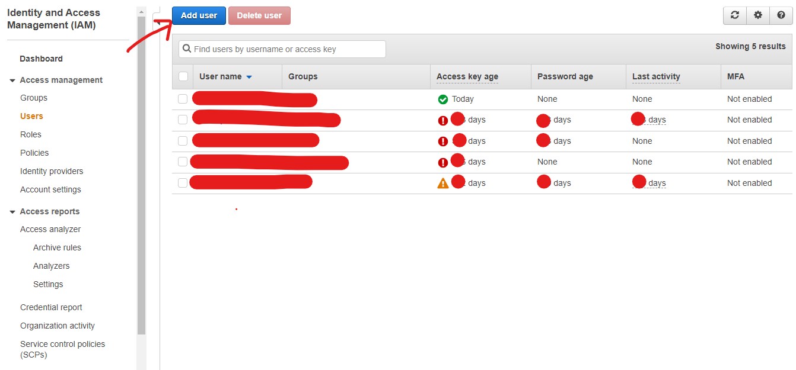

2. Add Name to your user and set **Access type** to `Programmatic access`.
   
   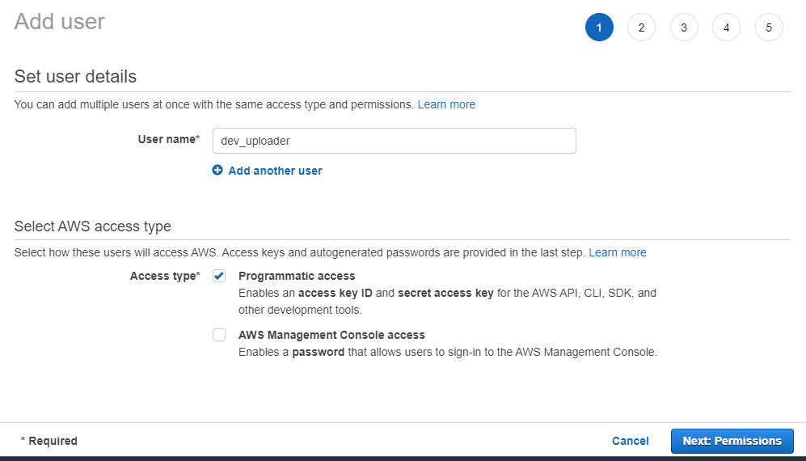

3. Look for **S3** in **Attach existing policies** tab, then select **AmazonS3FullAccess**.
   
   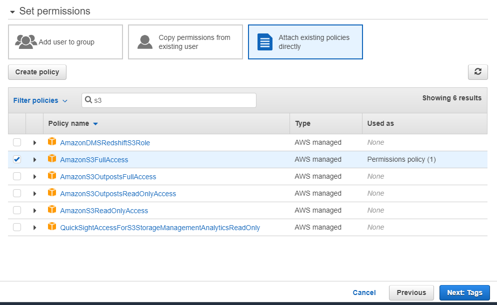

4. Tag it as `dev` environment.
   
   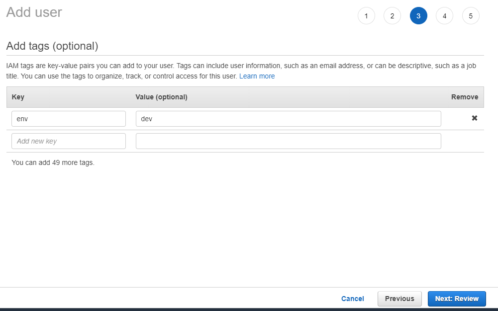

5. Make sure that **AmazonS3FullAccess** is selected.
   
   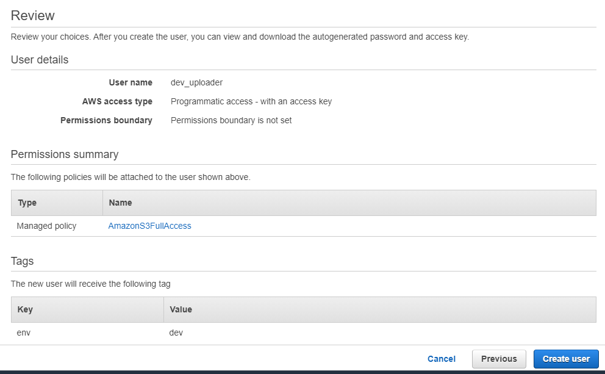

6. Save your `Access key ID` and `Secret access key`. We will be needing it later.

   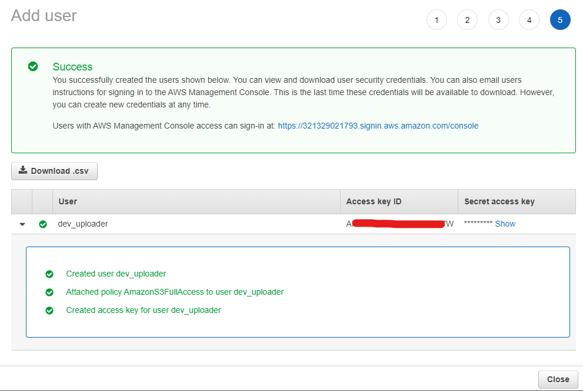


# Getting Started

To upload files in **AWS S3** with **Multer**. We have to setup [Storage Engine](https://github.com/expressjs/multer/blob/master/StorageEngine.md) and use [AWS SDK](https://docs.aws.amazon.com/sdk-for-javascript/v2/developer-guide/installing-jssdk.html).

## Setup our **Storage Engine**

Before we are create our **custom engine**, we need to make sure `/uploads` folder exist.

```
mkdir uploads
```

Create a new file called `S3StorageEngine.js`.

```javascript
const fs = require('fs');
const path = require('path');

// create a class
class S3StorageEngine{

    // add a constructor to that can override the destination
    constructor(opts = null){
        // if there is no options passed in our constructor
        // don't replace the getDestination function
        if(opts && opts.dest){
            this.getDestination = opts.dest;
        }
    }

    getDestination(req, file, cb){
        // NOTE: make sure /uploads folder exist, if not create it first
        // Use the original name when we save uploaded file in /uploads
        cb(null, path.join(__dirname, `uploads/${file.originalname}`));
    }

    // function that is called if file was uploaded
    _handleFile(req, file, cb){
        this.getDestination(req, file, function (err, path) {
        if (err) return cb(err);
    
        // we open a stream to write the file in disk
        const outStream = fs.createWriteStream(path)
    
        // stream the file then pipe (save it)
        // in the path from getDestination function
        file.stream.pipe(outStream)
            outStream.on('error', cb)
            outStream.on('finish', function () {
                // call callback write the
                cb(null, {
                    path: path, // we are saving it as `uploads/${file.originalname}`
                    size: outStream.bytesWritten // file size
                });
            });
        });
    }

    _removeFile(req, file, cb){
        // if there is problem with the file upload
        // we can remove the created stream in /uploads folder
        fs.unlink(file.path, cb);
    }

}

module.exports = S3StorageEngine;
```

Then update our `app.js`
```javascript
...

const Storage = require('./S3StorageEngine');
const uploader = multer({
    storage: new Storage()
});

...
```

Testing our `Custom Storage` should look like this.

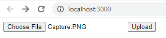

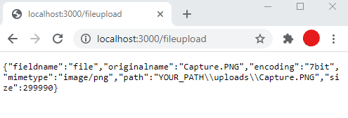

We can now setup our **AWS S3 uploader**.

## Setup our **AWS Bucket**

1. Find **S3** in **AWS Management Console**
   
   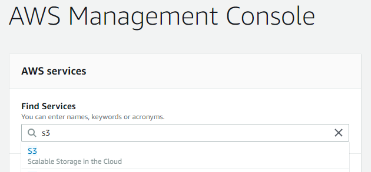

2. Create a bucket
   
   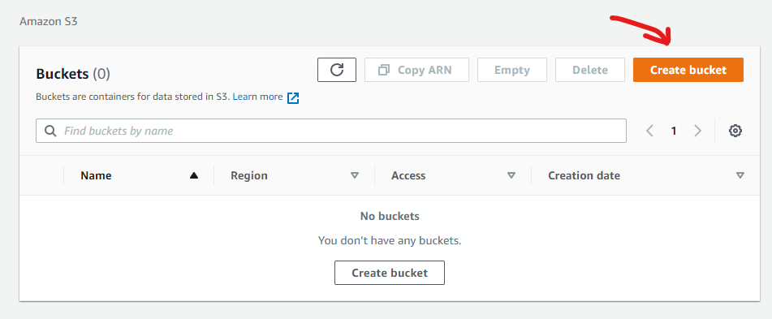

3. Add bucket name. I name my bucket as **codendebug-uploads**.
   
   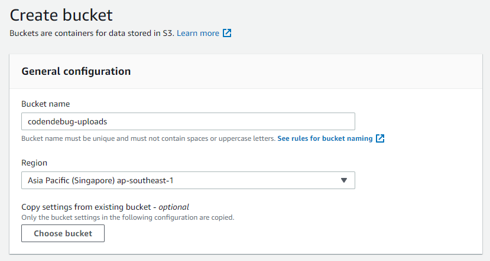   

4. Scroll to the bottom to create the bucket.
   
   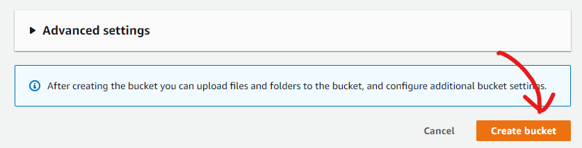

5. Congratulations you now have **AWS bucket**

   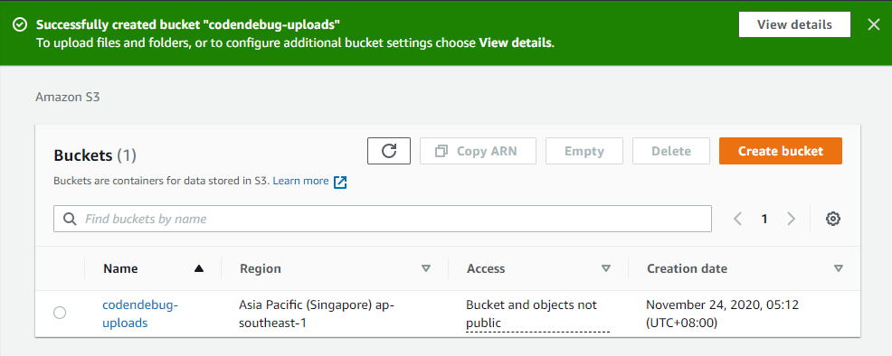

We can now setup our codes to create **S3 Uploader**.

## Setup our **AWS Uploader**

Let's import the library of [AWS SDK](https://docs.aws.amazon.com/sdk-for-javascript/v2/developer-guide/installing-jssdk.html).

```bash
npm install aws-sdk
```

Create a file named `S3Uploader.js`
```javascript
const AWS = require('aws-sdk');
const fs = require('fs');

class S3Uploader {
    constructor(config){
        // set the version
        this.version = config.version;
        
        // set the bucket name
        this.bucket = config.bucket;

        // initialize AWS config
        AWS.config.update({
            region: config.region, // region of your AWS S3
            accessKeyId: config.accessKeyId, // access key id we got in creating IAM user
            secretAccessKey: config.secretAccessKey // secret key we got in creating IAM user
        });
    }

    // upload function
    upload(name, path){
        let objectParams = {
            Bucket: this.bucket, // name of the bucket to upload
            Key: name,          // file name in bucket when uploaded
            Body: fs.readFileSync(path) // the file itself, read it to get the file buffer
        };
        
        // start the upload then return a promise that 
        // we will resolve in S3StorageEngine handleFile
        return new AWS.S3({ apiVersion: this.version })
        .upload(objectParams).promise();
    }
}

module.exports = S3Uploader;
```

Let's modify our `S3StorageEngine.js` to use `S3Uploader.js`
```javascript
// import our s3 uploader
const S3Uploader = require('./S3Uploader');

// configure s3 configs
const AwsS3 = new S3Uploader({
    region: 'ap-southeast-1',
    bucket: 'codendebug-uploads',
    version: '2006-03-01',
    accessKeyId: '***',     // use the access key we got earlier
    secretAccessKey: '***'  // use the secret key we got earlier 
});
```

Edit the `_handleFile` function, implement our **uploader**
after the **outStream's** `finish` event.
This ensures that we only upload the file after it was written on disk.
```javascript
...
outStream.on('finish', function () {
    // instead of just saving the file
    // call the S3Uploader to upload the file in S3
    
    // use the original name as Key
    // pass the file path to get it in S3Uploader
    AwsS3.upload(file.originalname, path)
    // if s3 upload was successful
    .then(data=>{
        // unlink the file since it was already uploaded in AWS S3
        fs.unlink(path, cb);
        // call callback that it was done
        cb(null, {
            s3url: data.Location, // add AWS S3 file location in response
            path: path, // this is not needed anymore since file is in S3
            size: outStream.bytesWritten // file size
        });
    
    // if there is problem with the s3 upload
    }).catch(error=>{
        // return callback error if there is problem with upload
        // it will trigger removeFile function
        cb(error);
    })
});
...
```

The complete code of our `S3StorageEngine.js` should look like this.

```javascript
const fs = require('fs');
const path = require('path');

// import our s3 uploader
const S3Uploader = require('./S3Uploader');

// configure s3 configs
const AwsS3 = new S3Uploader({
    region: 'ap-southeast-1',
    bucket: 'codendebug-uploads',
    version: '2006-03-01',
    accessKeyId: '***',     // use the access key we got earlier
    secretAccessKey: '***'  // use the secret key we got earlier 
});

// create a class
class S3StorageEngine{

    // add a constructor to that can override the destination
    constructor(opts = null){
        // if there is no options passed in our constructor
        // don't replace the getDestination function
        if(opts && opts.dest){
            this.getDestination = opts.dest;
        }
    }

    getDestination(req, file, cb){
        // NOTE: make sure /uploads folder exist, if not create it first
        // Use the original name when we save uploaded file in /uploads
        cb(null, path.join(__dirname, `uploads/${file.originalname}`));
    }

    // function that is called if file was uploaded
    _handleFile(req, file, cb){
        this.getDestination(req, file, function (err, path) {
            if (err) return cb(err);
        
            // we open a stream to write the file in disk
            const outStream = fs.createWriteStream(path)
    
            // stream the file then pipe (save it)
            // in the path from getDestination function
            file.stream.pipe(outStream)
            outStream.on('error', cb)
            outStream.on('finish', function () {
                // instead of just saving the file
                // call the S3Uploader to upload the file in S3
                
                // use the original name as Key
                // pass the file path to get it in S3Uploader
                AwsS3.upload(file.originalname, path)
                // if s3 upload was successful
                .then(data=>{
                    // unlink the file since it was already uploaded in AWS S3
                    fs.unlink(path, cb);
                    // call callback that it was done
                    cb(null, {
                        s3url: data.Location, // add AWS S3 file location in response
                        path: path, // this is not needed anymore since file is in S3
                        size: outStream.bytesWritten // file size
                    });
                
                // if there is problem with the s3 upload
                }).catch(error=>{
                    // return callback error if there is problem with upload
                    // it will trigger removeFile function
                    cb(error);
                })
            });
        });
    }

    _removeFile(req, file, cb){
        // if there is problem with the file upload
        // we can remove the created stream in /uploads folder
        fs.unlink(file.path, cb);
    }

}

module.exports = S3StorageEngine;
```

Testing our **s3 uploader** will result to this.


Notice the added `s3url`, which is the location of the **uploaded** file.

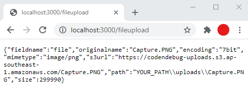

Voila! You can now view your uploaded files in **AWS S3 Console**.

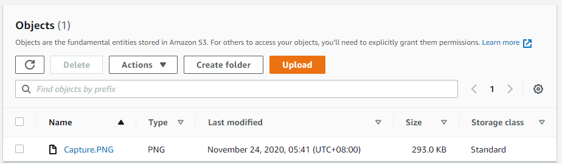

# Summary

Taking advantage of [SaaS](https://en.wikipedia.org/wiki/Software_as_a_service) service's will benefit you a lot. It will save you a lot of time in configuring your server to accomodate the scalability in your application.

I hope this opens up an opportunity for you to be more creative on how you create your application.

Happy Coding 😃