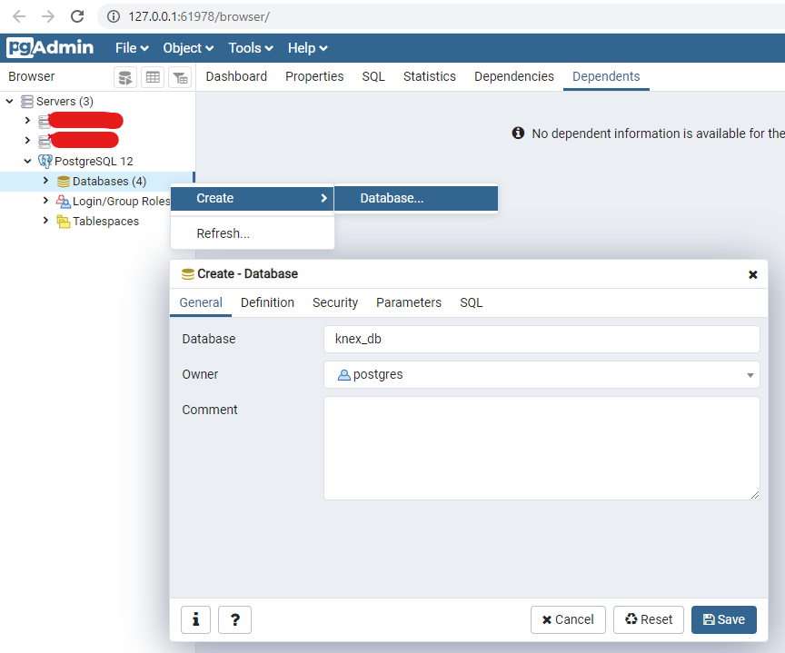
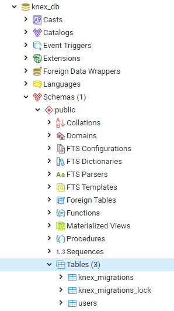
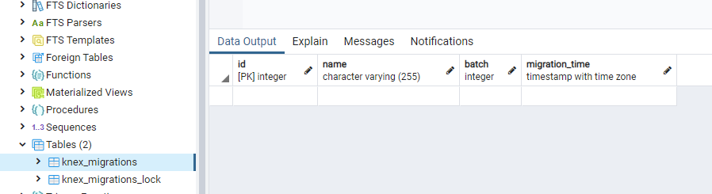

In developing software in agile environment. Developers choose to develop their source code together with the database.
This database changes should be tracked, shared and maintained in incremental manner.
That's how schema migration tools are born. It helps developers to automate the reversal and updation of database schema.

When working with [NodeJS](https://nodejs.org/en/), there is a package called [Knex.JS](http://knexjs.org/) that could help us in manage our database with less effort.

# Prerequisite
You need to have the following before proceeding:
- [NodeJS](https://nodejs.org/en/download/)
- Database (any of the following Postgres, MSSQL, MySQL, MariaDB, SQLite3, Oracle and Amazon Redshift)

# What is Knex?
[Knex.JS](http://knexjs.org/) is a sql builder for Postgres, MSSQL, MySQL, MariaDB, SQLite3, Oracle and Amazon Redshift. More than as sql builder, it also supports seeding and migration.

# Installing [Knex.JS](http://knexjs.org/)
One thing you need to remember when using [Knex.JS](http://knexjs.org/), is that it is only an adapter for the database you will use.
Meaning, when installing [Knex.JS](http://knexjs.org/), you also need to install the database connector that you need.
```
npm install knex --save

# Then add one of the following database:
npm install pg
npm install sqlite3
npm install mysql
npm install mysql2
npm install oracledb
npm install mssql
```

> NOTE: In this tutorial I'll be using Postgres.

To run the **knex** cli easily, I also install **knex** globally in npm.
```
npm install -g knex
```

# Setup
Let's create our database in Postgres.




We first need to initialize knex in our project.
```
knex init
```
This will create `knexfile.js` which will be using to connect to the database.
```javascript
// Update with your config settings.

module.exports = {
  development: {    // the root config that we will use
    client: 'pg',   // we are using Postgres so i set it up as pg, set the client you have (mysql, mysql2, etc...)
    connection: {
      database: 'knex_db',    // db name
      user:     'postgres', // db user
      password: 'password'  // db password
    },
    pool: {         // knex easily sets our connection as a pool
      min: 2,       // leave as default
      max: 10       // leave as default
    },
    migrations: {   // the name of migration table
      tableName: 'knex_migrations'
    }
  }
};
```

# [Knex](http://knexjs.org/#Migrations-latest) Migrate

Let's create our first migration.
```
knex migrate:make user
Using environment: development
Created Migration: path\to\project\migrations\20201202164643_user.js
```

Generated file `20201202164643_user.js`, looks like this.
```javascript
// called on migration
exports.up = function(knex) {
  // add your db change here
};
// called on rollback
exports.down = function(knex) {
  // add your db change here
};
```

We can use this file to create our `user table`.
```javascript
exports.up = function(knex) {
  // create users table
  return knex.schema.createTable('users', function(table){
    // you can use this knex cheat sheet for more schema reference
    // https://devhints.io/knex#schema
    table.increments('id');
    table.string('username', 30).notNullable();
    table.string('password', 100).notNullable();
  });
};
exports.down = function(knex) {
    // drop users table
  return knex.schema.dropTableIfExists('users');
};
```

To run our migration, we can use `knex migrate:latest` command.
```
knex migrate:latest
Using environment: development
Batch 1 run: 1 migrations
```

Which will create the table for us.



Since we set our config to use this 
```javascript
{
  ...,
  migrations: {   // the name of migration table
    tableName: 'knex_migrations'
  }
}
```

[Knex](http://knexjs.org/) creates `knex_migrations` and `knex_migrations_lock` tables. 
This tables keeps track all the migration that has been done in your database through knex commands.

# [Knex](http://knexjs.org/#Migrations-rollback) Rollback

Rolling back our change
```
knex migrate:rollback
Using environment: development
Batch 1 rolled back: 1 migrations
```

Our table will now look like this.



# Conclusion

We only touch the basic capability of [Knex.JS](http://knexjs.org/) in terms of migrations. There are still a lot more to cover.

```
  migrate:make [options] <name>           Create a named migration file.
  migrate:latest [options]                Run all migrations that have not yet been run.
  migrate:up [<name>]                     Run the next or the specified migration that has not yet been run.
  migrate:rollback [options]              Rollback the last batch of migrations performed.
  migrate:down [<name>]                   Undo the last or the specified migration that was already run.
  migrate:currentVersion                  View the current version for the migration.
  migrate:list|migrate:status             List all migrations files with status.
  migrate:unlock                          Forcibly unlocks the migrations lock table.
```

I hope this can get you started using [Knex.JS](http://knexjs.org/) in your own application. Until `knex` time!

Happy Coding! 😃